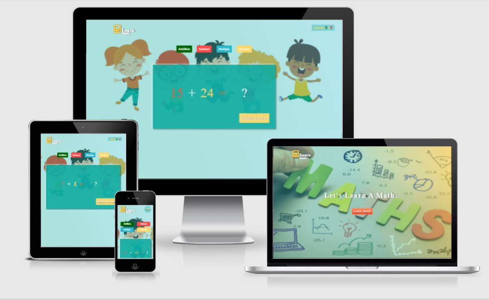

# learn_math_calculation_project

Test your math skills with this basic math practice test with addition, subtraction, division and multiplication problems.

[View Live Project Here](https://jas-sin82.github.io/learn_math_calculation_project/)

## Frontend Development Project 

In this project I have used HTML for structure, css for style to make more user intractive , JavaScript for functionality to make the webpage more user intractive && Finally media query and bootstrap to make webpage mobile responsive.

## Screenshot of project 
# Desktop, Ipad, laptop  & Mobile
  

